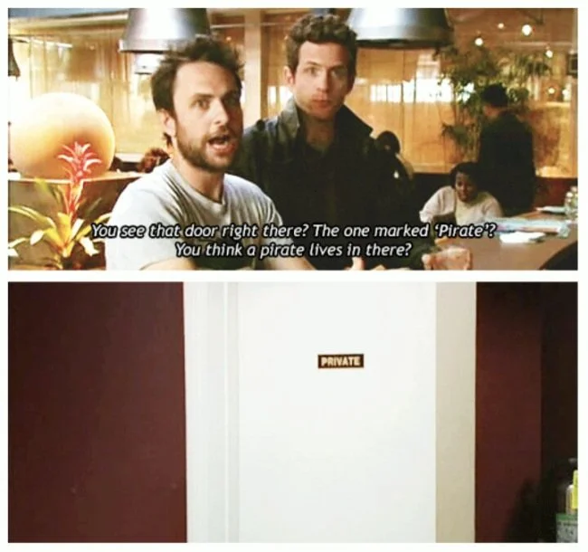

# OOP - Object Oriented Programming
###### Or Ogres (love) Onion Peeling for the cultured programmers among us!
For this challenge, I have to finish some exercises to learn a bit more about Object Oriented Programming.
I tried working with classes in the past, but it was still a bit too complicated for me.
So I'm really looking forward to this challenge, because OOP is something I really want to learn how to do!

## Exercise 1: "Programming with class(es)."
The hardest part about OOP, in my opinion, is that you need to define everything you do.
````
class Beverage {
    public string $color;
    public int $price = 0;
    public string $temperature = "cold";

    public function __construct(string $color, int $price, string $temperature) {
        $this ->color =$color;
        $this->price = $price;
        $this->temperature = $temperature;
    }
````
It was quite difficult for me to remember to write code this way.
But I do want to keep getting better at this, writing code like this makes a lot more sense (once you understand it though).
And projects can keep getting bigger and bigger without causing a major headache.

## Exercise 2: "Beverage, you ARE the father of lil' softdrinks!"
The biggest challenge of this exercise, was not only understanding what parent constructors are, but also how to use them!
First I needed to create a new class called "Beer" that extends from the class "Beverage", the code looks something like this:
````
class Beer extends Beverage {}
````
Once that's done, inside the *curly moustache* brackets, you declare the new variables of the child class, which in this case, is the class "Beer".

The next step is the one I struggled with the most.
But once I've finished this piece of code, I did however understand parent constructors **A LOT** better.
Theoretically, the concept does make a lot of sense.
But writing it out yourself in practice is something completely else.

You create a new construct, but declare the previous variables again in between the brackets, but you **add** the two new variables of the child element.
Then, in the function itself, you add the parent::__construct.

This is how the code looks like, because just an explanation is not enough to really understand how something works.
````
public function __construct(string $color, float $price, string $temperature, string $name, float $alcoholPercentage)
    {
        parent::__construct($color, $price, $temperature);
        $this->name = $name;
        $this->alcoholPercentage= $alcoholPercentage;
    }
````

## Exercise 3: "The Pirate Exercise"


For the ~~pirate~~ - I mean the private exercise I had to make all properties private, and then still make all the code work.
The hardest part about this exercise, was the same thing that I've been struggling with regarding all exercises so far.
And that is, knowing how to write the code.
Thankfully, this is something that just keeps getting easier and easier as time goes on.

Once I wrote down all the getter functions, the code started working again smoothly.
The next challenge was using the setters.
Setters, quite literally, set a new value for the object (please do correct me if I'm wrong on this one).

The final task of this exercise, was to create a new private method and then to print this method.
I was wondering if we could even print private methods, since they are, you know, **private**.
And I was right, I couldn't print it.
At least if I couldn't print it if I wasn't paying attention the entire darn time I was making these exercises!
I realized I needed to create a public function that return the private method, and print that public function instead.

## Exercise 4: "Protected"
Now I had to change all private properties to protected properties, fix all errors that might occur, and not call any getters from the child class.
After I changed all the properties, I saw that one line of code wasn't working properly.
That was because I had used $Duvel->color, instead of $Duvel->getColor().
The parent classes can only be accessed through the getter functions, the child classes however, can be accessed normally.
After I changed that piece of code, I replaced all the instances of me calling something from the child classes from a getter, to just calling them normally.

So I changed this:
````
private function beerInfo () :string {
    return("Hi I'm " . $this->getName() . " and I have an alcohol percentage of " .$this->getAlcoholPercentage() . " and I have a " . $this->getColor() . " color." );
}
````
To this:
````
private function beerInfo () :string {
    return("Hi I'm " . $this->name . " and I have an alcohol percentage of " .$this->alcoholPercentage . " and I have a " . $this->color . " color." );
}
````
This exercise perfectly encapsulates the difference between private and protected properties.

## Exercise 5: "PUBLIC: Pretty Unsightly Behaviour (from those) Losers In Chicago"
###### Sorry for the weird title I just really like inventing acronyms.
First I copied everything from exercise 1, and then I turned all public properties to private.
If any bugs or errors were caused because of this, I had to solve them without using getters or setters.
Thankfully, there were no errors or bugs.

Then I had to adjust the price of one of the objects, without using setters or getters.
This was a lot of brainwork, I first thought I might have to edit the constructor in some way.
This however was not the case, I had to add a function that will return a string with the new price in it.

I learned a lot of new things from this exercise as well.
I discovered that you can create new variable in between the brackets of the function, and use this in the function that you are creating.
Practice is essential, since I've only used the code this way just once, I'm sure I won't remember all the details of what I did.
What I won't forget however, is for what I can use this way of coding for.


````
public function theEconomyIsInShambles (float $newPrice) :string {
    if ($this->price < $newPrice) {
        return ("The new price is " . $newPrice);
    }
    else {
       return ("Stop! You have violated the Law!");
    }
}
````
